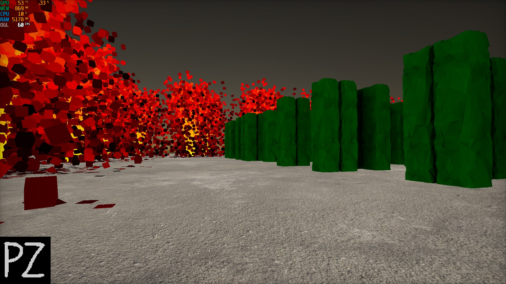

# PZX Game Engine

Author: Przemyslaw Zaworski
 
Licence: MIT

Source code: ~1100 lines of code, C / OpenGL (GLSL)

Compilation: cl demo.c opengl32.lib library\OpenAL32.lib user32.lib gdi32.lib

Features:

* Mesh rendering with baked vertex ambient occlusion

* Voxel based particle effects

* Texture mapping with mipmaps and anisotropic filtering

* Procedural dynamic skybox with Rayleigh scattering

* Post-processing effects (vignette and film grain)

* Audio effects (OpenAL)

* 3D box collision detection

* Input: keyboard (WSAD) and mouse

* Optional wireframe rendering (hold X button)

